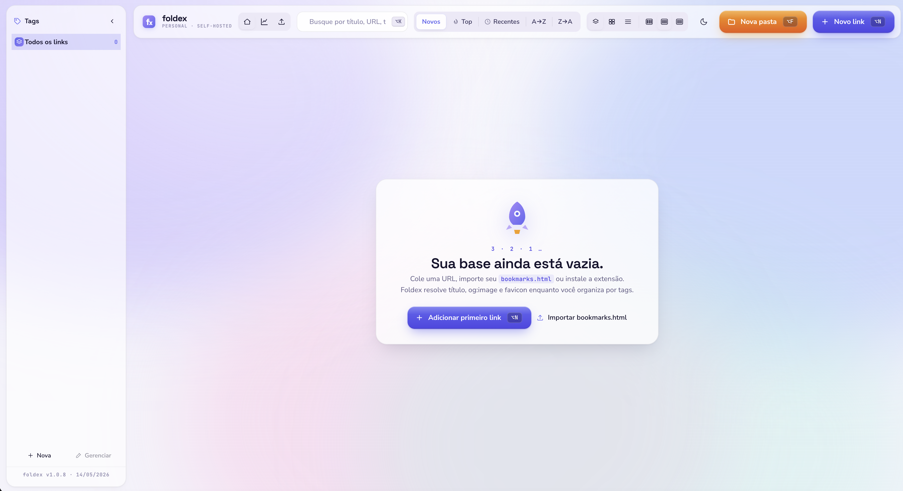

# Foldex

<p align="right"><sub><a href="./README.md">🇺🇸 English</a> · <strong>🇧🇷 Português</strong></sub></p>

<p align="center">
  
</p>

> Gerenciador de bookmarks self-hosted com tagging avançado, pastas aninháveis, contagem de cliques, previews visuais de URL, **detecção de mudança por link + Web Push**, backup completo, UI em en/pt/es e extensão de navegador.

Foldex é uma "smart bookmarks bar" pessoal — guarda links organizados por **pastas aninháveis + tags M:N**, mostra **o que você de fato clica** (telemetria via `/go/:id`), captura visualmente cada URL (OG image / favicon / fallback de screenshot) e roda **inteiramente na sua máquina** (Postgres + MinIO + Go + React em containers).

> Stack: **Go 1.26 (Chi · pgx) · PostgreSQL 18 · MinIO · Vite 8 + React 19 + TypeScript + bun · TanStack Query · react-i18next (en/pt/es) · Vitest 4**. Política de versionamento + invariantes em [`CLAUDE.md`](CLAUDE.md).

---

## Por que foldex em vez do bookmark nativo do navegador?

Bookmark nativo é ótimo para "salvar uma página rápida e esquecer". Quando você passa de 50 links, a fricção começa a doer. Foldex resolve cada uma dessas dores:

| Dor do bookmark nativo                                                                  | Como foldex resolve                                                                                                              |
| --------------------------------------------------------------------------------------- | -------------------------------------------------------------------------------------------------------------------------------- |
| **Preso a um navegador.** Chrome ↔ Safari ↔ Firefox = 3 silos. Sync exige conta no fornecedor. | Seu próprio servidor. Acessa de qualquer browser, em qualquer máquina da sua rede. Os dados ficam num Postgres que **você** controla. |
| **Só árvore.** Um bookmark mora em UMA pasta. Quer "trabalho + ia + notebookLLM"? Triplica. | **Tags M:N** (um link pode ter N labels) **+ pastas 1:N aninháveis** (containment iPhone-style). Os dois sistemas coexistem. |
| **Zero telemetria.** Você "favorita" 200 links e usa 8. Não sabe quais.                 | Toda navegação passa por `/go/:id` que insere em `click_log`. Página de stats mostra cliques por dia, top hosts, top links (últimos 30d), distribuição por tag. |
| **Preview = favicon 16×16.** Lista cinza com mini-ícones.                               | Card visual com OG image. Se a página não tem, foldex **captura screenshot** automaticamente (Chromium headless → MinIO). Você pode também subir uma imagem manual. |
| **Busca fraca.** Match só no título/URL.                                                | Busca full-text via Postgres `pg_trgm` em título + URL + descrição. Compõe com filtro por tag (AND-multi-tag) e escopo de pasta. |
| **Backup = arquivo Netscape opaco.** Imagens? Cliques? Hierarquia? Tudo perdido.        | ZIP de backup único com `manifest.json` + `database.json` (5 tabelas) + **todas as imagens do MinIO**. Round-trip lossless, verificação por checksum SHA-256, 3 modos de conflito (wipe/skip/duplicate). |
| **Atalhos engessados.** Cmd+D abre o diálogo nativo do navegador.                       | Extensão MV3 + Alt-K (palette), Alt-N (novo link), Alt-F (nova pasta). Drag-and-drop iPhone-style entre cards/pastas. |
| **Lock-in do fornecedor.** Sair do Chrome = exportar HTML + perder metadados.           | Export para **Netscape HTML** (compat universal) **OU** JSON v2 (com pastas + click_count) **OU** ZIP de backup completo. Importer aceita os três (idempotente por URL; `click_count` é limitado na importação pra um arquivo hostil não inflar o log de cliques). |
| **Só em inglês / sem localização.**                                                      | UI totalmente localizada em **English / Português / Español** via `react-i18next`. Seletor de idioma no topbar; autodetecção pelo idioma do navegador no primeiro acesso; escolha persiste no `localStorage`. |
| **Pinned/favoritos = uma pastinha à parte.** Só visual.                                 | `pinned` é coluna real na tabela. `ORDER BY pinned DESC, …` aplica em todo modo de ordenação. Badge gradient sempre visível. |
| **Dados embutidos no navegador.** Trocou de máquina? Reinstalou Chrome? Reza.           | Postgres + MinIO em containers. `make up` numa máquina nova e seu ZIP de backup restaura tudo (DB + imagens) em ~minutos. |

### Cenários reais que viraram a chave (bookmark nativo → foldex)

- **"Quais dashboards eu de fato uso?"** → a página de stats mostra top hosts e top links nos últimos 30 dias. Larga os de 0 cliques.
- **"Quero compartilhar `localhost:9089/go/42` com a equipe."** → toda URL ganha um alias estável `/go/:id` que redireciona + loga o clique.
- **"Trocar de máquina sem perder nada."** → 1 botão na UI gera o ZIP de backup completo. Outro botão na máquina nova restaura com `mode=wipe`.
- **"O mesmo link mora em 3 contextos (trabalho + ia + arquitetura)."** → 3 tags. Aparece nos 3 filtros.
- **"Quero saber visualmente qual link é qual antes de clicar."** → cada card mostra um preview OG/screenshot/upload em 150px.

### Quando foldex é overkill

Se você tem menos de 30 links salvos e usa **um único navegador numa única máquina**, bookmarks nativos são mais simples. Foldex começa a fazer sentido quando você precisa de acesso cross-browser, telemetria ou organização real em mais de uma dimensão.

---

## Quickstart

```bash
cp .env.example .env
make up                 # puxa justoeu/foldex-{backend,web}:latest do Docker Hub
                        # + sobe Postgres em 127.0.0.1 (sem precisar de toolchain Go/bun)
make migrate-up         # aplica as migrations SQL
make seed               # opcional: tags + links de exemplo

open http://localhost:9088
```

### Escolher entre imagens pré-buildadas e build local

| Quer … | Rode | Notas |
|---|---|---|
| Só rodar Foldex | `make up` | Puxa `justoeu/foldex-{backend,web}:${FOLDEX_VERSION}` do Docker Hub. Tag default é `latest`. |
| Pinar num build específico | setar `FOLDEX_VERSION=sha-3f6cc06` (ou `v1.4.1`) no `.env` e `make up` | Tags publicadas por commit + por release semver. |
| Atualizar pra última tag | `make pull && make up` | `pull` re-baixa sem reiniciar; `up` percebe a imagem nova e reinicia. |
| Desenvolver / buildar do source | `make up-build` | Usa os mesmos `Dockerfile`s mas builda local, ignorando a imagem do registry. Precisa de Docker; NÃO precisa de Go/bun no host (rodam dentro dos build stages). |
| Aplicar mudanças locais | `make restart-backend` / `make restart-web` | Igual ao `up-build` mas só do serviço nomeado. |

### HTTPS (dev local) via mkcert

Nginx serve o container web em HTTPS na `:443` interna, exposto no host em
`WEB_HTTPS_PORT` (default **9444**). O cert é assinado por uma CA local —
para o navegador confiar sem warnings, instale o
[`mkcert`](https://github.com/FiloSottile/mkcert) uma vez no host e emita
o par em `web/certs/`:

```bash
brew install mkcert nss      # nss só é necessário pro Firefox
mkcert -install              # instala a CA local no trust store do sistema
                             # (pede sua senha de sudo + um clique de
                             # confirmação no Keychain Access no macOS)

mkdir -p web/certs
mkcert -cert-file web/certs/cert.pem \
       -key-file  web/certs/key.pem \
       localhost 127.0.0.1 ::1 host.docker.internal

make up                       # reinicia o container web; certs vêm via bind-mount de web/certs
open https://localhost:9444   # 9444 = WEB_HTTPS_PORT; 9088 (WEB_PORT) é redirect HTTP→HTTPS
```

Os arquivos `cert.pem` e `key.pem` são **gitignored** — gere localmente,
nunca commite. O container web faz bind-mount de `./web/certs:/etc/nginx/certs:ro`
no boot, então você só precisa de `make restart-web` (ou `make up`) depois
de re-emitir o par — sem rebuild. A imagem publicada no Docker Hub não
shippa **nenhum** material TLS; se o volume estiver vazio (ex.: `docker pull && docker run`
puro sem mount), o container gera um par self-signed efêmero pra o
navegador conseguir alcançar a SPA.

Re-rode `mkcert ...` quando adicionar um hostname novo (ex.: um
`*.foldex.test` apontando pra `127.0.0.1`) ou depois de reinstalar a
CA local (`mkcert -install`) numa máquina nova.

> **Ainda aparece "Not Secure" no navegador?** Significa que a CA root
> do mkcert não está no trust store dessa máquina (ou está, mas o cert
> foi assinado por outra CA — comum quando se move o projeto entre
> máquinas). Rode `mkcert -install` e reemita os PEM com o bloco acima;
> depois `make up` para rebuildar a imagem nginx com os certs novos.

> **Reusar um Postgres que já roda no host.** Setar `POSTGRES_HOST=host.docker.internal`
> no `.env` (e `POSTGRES_USER` / `POSTGRES_PASSWORD` / `POSTGRES_DB`
> correspondentes), pular `make db-up` e rodar `make apps-up`
> diretamente. Migrations precisam ser aplicadas contra esse DB na mão
> (ou `make migrate-up` se o usuário/db existirem).

## Arquitetura do stack

Postgres vive em `docker-compose.db.yml` (projeto compose próprio).
Backend + web vivem em `docker-compose.yml` e se conectam à rede
Docker compartilhada `foldex` para alcançar o Postgres pelo nome `db`.
Targets úteis (`make help`):

| Target | O que faz |
|---|---|
| `make db-up` / `db-down` / `db-nuke` | gerenciar só o Postgres |
| `make apps-up` / `down` | gerenciar só backend + web |
| `make up` / `stop-all` | stack completo (Postgres + apps) |
| `make migrate-up` / `migrate-down` | aplicar / reverter migrations SQL |
| `make psql` | shell no Postgres |
| `make logs` / `db-logs` | seguir logs |

## Tests + coverage (gate: ≥ 85%)

```bash
make test-backend       # só unit (sem Docker)
make test-integration   # unit + integration (Docker necessário)
make coverage-backend   # garante 85% no backend
make coverage-web       # garante 85% no frontend (Vitest)
make coverage-all       # ambos
( cd backend && make fmt-check )   # gate de gofmt — parte do pre-push gate
```

Regras de coverage, exclusões e o **pre-push gate** completo (gofmt + vet + coverage, rodados localmente antes de cada commit) estão em [`CLAUDE.md`](CLAUDE.md) §6.1. Toda implementação também roda um **sweep obrigatório de 5 agentes** (Code Review · Code Quality · Test Quality · Performance · Security) antes do merge — veja §9. Leia antes de abrir um PR.

Outros targets: `make logs`, `make psql`, `make healthz`, `make down`.
Veja `make help`.

## Smoke test (sanity check depois de `make up`)

```bash
# 1. Backend de pé?
curl -s localhost:9089/healthz | jq .

# 2. Cria uma tag.
curl -s -X POST localhost:9089/api/tags \
  -H 'Content-Type: application/json' \
  -d '{"name":"jira","color":"#1f6feb","icon":"🪲"}' | jq .

# 3. Cria um link associado àquela tag (preview é enfileirado async).
curl -s -X POST localhost:9089/api/links \
  -H 'Content-Type: application/json' \
  -d '{"url":"https://news.ycombinator.com","title":"HN","tag_ids":[1]}' | jq .

# 4. Espera ~2s pelo worker; depois fetch — `preview_status` deve ser "ok".
sleep 3 && curl -s localhost:9089/api/links/1 | jq '.preview_status, .og_image_url'

# 5. Resolve o short link (302 + bump no contador).
curl -sI localhost:9089/go/1 | head -3

# 6. Abre a SPA e tenta ⌥K (palette) / ⌥N (novo link).
open http://localhost:9088
```

## Atalhos de teclado (SPA)

| Atalho           | Ação                            |
|------------------|---------------------------------|
| `⌥K` / `Alt+K`   | Command palette (busca fuzzy). `⌘K` conflita com o foco da URL bar do navegador. |
| `⌥N` / `Alt+N`   | Novo link (⌘N é hard-claimed pelo navegador para "Nova janela") |
| `⌥F` / `Alt+F`   | Nova pasta (⌥P colidia com outros handlers; "F" de Folder) |
| `Esc`            | Fecha qualquer modal aberto / sai da view de pasta |
| `⌘Enter` (popup) | Salva (na extensão do navegador) |

> **Convenção**: todo atalho do foldex é Alt-based. Os navegadores
> engolem a maioria das combinações com `⌘` (⌘K = focus URL bar, ⌘N =
> nova janela, ⌘P = imprimir), então atalhos com prefixo Alt são os
> únicos que chegam à SPA com confiança.

## Internacionalização

Toda a UI passa por `react-i18next`. **Inglês é a fonte da verdade**; **Português** e **Español** são mantidos em paridade total (toda chave espelhada nos três).

- **Trocar idioma**: seletor no topbar. A escolha persiste em `localStorage["foldex.locale"]`; no primeiro acesso autodetecta de `navigator.language`, com fallback pra inglês.
- **Arquivos de locale**: `web/src/i18n/locales/{en,pt,es}.json`.
- **Adicionar locale**: solte um novo `<lang>.json`, liste em `SUPPORTED_LOCALES` e popule toda chave a partir de `en.json`. Plurais usam o sufixo `_one` / `_other`.

Toda string visível ao usuário precisa passar por `t('key')` e existir nos três locales — invariante no `CLAUDE.md`.

## Extensão de navegador

Uma extensão Manifest V3 vanilla vive em `extension/`. Carregue como
**unpacked** em `chrome://extensions` → Modo de desenvolvedor → Carregar
sem compactação → escolhe a pasta `extension/`. Depois clica no ícone
em qualquer aba e aperta Salvar. Veja `extension/README.md`.

## Screenshots

O hero do empty-state lá em cima é a Home view numa instalação fresca.
Mais capturas vêm conforme o projeto ganha conteúdo:

- Grid de home populado (cards + densidade 3/5/8 colunas)
- Command palette (`⌥K`)
- Dialog de novo link com tag autocomplete
- Página de import (drag-drop) + preview com mode picker
- Página de stats (KPIs, top hosts, distribuição por tag)
- Popup da extensão

## Layout

| Path           | O que tem |
|----------------|-----------|
| `backend/`     | Serviço Go (Chi + pgx + Postgres 18) — REST API, redirect, workers de preview + change-check + push |
| `web/`         | SPA Vite + React + TypeScript. CSS handoff (`styles/foldex.css`) + `overrides.css` local. |
| `extension/`   | Extensão Manifest V3 para capturar a aba atual |
| `docs/`        | Docs SDD: `VISION.md`, `ARCHITECTURE.md`, `TASKS.md` |
| `scripts/`     | Helpers de seed + backup |

## Backup & Restore

Snapshot completo do DB **e** do bucket MinIO num único ZIP. Três
endpoints:

```bash
# Gera — streama um ZIP. Headers expõem counts + duração.
curl -OJ http://localhost:9089/api/backup
unzip -l foldex-backup-*.zip
#   manifest.json
#   database.json
#   files/screenshots/{id}.png
#   files/images/{id}.{ext}

# Valida (sem aplicar)
curl -X POST -F file=@foldex-backup-*.zip \
  http://localhost:9089/api/backup/validate | jq

# Restaura — 3 modos de conflito
curl -X POST -F file=@foldex-backup-*.zip \
  'http://localhost:9089/api/backup/restore?mode=skip' | jq
#   mode=wipe       — TRUNCATE tudo + restaura com IDs originais (DESTRUTIVO)
#   mode=skip       — preserva existentes (ON CONFLICT DO NOTHING; default)
#   mode=duplicate  — renomeia tags conflitantes pra "nome (2)"; pastas sempre novas;
#                     links com colisão de URL caem para skip + warning
```

Via UI: abre a página **Importar / Exportar** → coluna direita tem o
card **💾 Backup completo**. Arrasta um `.zip` em cima pra revisar o
sumário de validação e escolher o modo no `BackupRestoreDialog`.
Histórico (últimos 10 backups: data, duração, tamanho, counts) persiste
em `localStorage`.

> **Ressalva de idempotência no restore.** O `mode=skip` é idempotente para as entidades com UNIQUE (tags por nome, links por URL — re-rodar o mesmo zip não insere nada). `click_log` e `folder` não têm chave natural, então um segundo skip do mesmo zip **re-insere** essas linhas. Rode o skip uma vez; use `mode=wipe` pra rebaselinar do zero.

Design completo: [docs/SDD-BACKUP-RESTORE.md](docs/SDD-BACKUP-RESTORE.md).

## Docs

- [Vision](docs/VISION.md) — problema, goals, critérios de sucesso
- [Architecture](docs/ARCHITECTURE.md) — stack, modelo de dados, API, ADRs
- [Tasks](docs/TASKS.md) — log de implementação por fase
- [SDD: Backup & Restore](docs/SDD-BACKUP-RESTORE.md) — ZIP de snapshot DB + MinIO, modos de conflito, fluxo de validação

## Licença

[MIT](LICENSE) © 2026 Valmir Justo.
